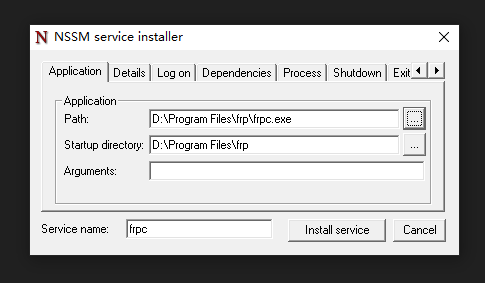
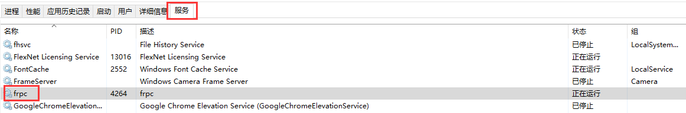
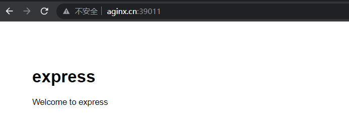

## 背景
xx公司打卡提供一个接口，传入手机号、时间戳和门禁id即可，由于接口部署在公司内网。先有两种方案可行。
一、vpn拨号，
二、内网穿透。
这里主要记录方案二操作步骤。
## 内网穿透

### 服务器安装及配置frp
1.下载frp
```sh
  //下载地址是:   https://github.com/fatedier/frp/releases
  
  //下载的版本是 0.26.0
  
  frp文件名称: frp_0.26.0_linux_386.tar.gz
```
2.上传frp到目标服务器

3.解压到当前路径
```shell
  tar -zxvf frp_0.26.0_linux_386.tar.gz
  cd /usr/local/usr/frp_0.26.0_linux_386/
  // 这里会发现有frpc、frpc.ini和frps、frps.ini 四个文件
  // 其中frpc frpc.ini 是客户端的相关文件
  // 其中frps frps.ini 是服务端的相关文件
```
4.配置服务端
4.1编辑frps.ini文件
```shell
  [common]
  bind_port = 39010 //frp程序占用端口
  vhost_http_port = 39011 //http访问时暴露端口
```
4.2 启动frps(普通启动)
```sh
  // 启动命令
  ./frps -c ./frps.ini
```
4.3 启动frps(pm2后台启动)

4.3.1 当前目录创建文件frp.sh，并写入内容
```shell
  #! /bin/bash
  ./frps -c frps.ini
```
4.3.2 启动
```shell
  pm2 start ./frp.sh --name frps
  // 没有pm2则先安装， npm install pm2 -g
```

### 客户端安装及配置frp
1.下载frp

2.编辑frpc.ini文件
```shell
  [common]
  server_addr = 120.25.27.70 //填写公网ip
  server_port = 39010 //服务器frps占用端口

  [web]
  type = http
  local_port = 8099 //本地服务端口
  custom_domains = aginx.cn //填服务器域名
```
3.客户端启动
```shell
  ./frpc.exe
```
### NSSM将客户端frp注册为服务
为了方便frp在win10启动，可以设置为服务，让其后台自启。

首先下载nssm，官网链接:https://nssm.cc/download

NSSM是一个服务封装程序，它可以将普通exe程序封装成服务，使之像windows服务一样运行。同类型的工具还有微软自己的srvany，不过nssm更加简单易用，并且功能强大。

服务安装使用如下命令
```bash
  ./nssm.exe install frpc
```


执行此命令后，会出现一个界面，基本上看着就知道怎么用了，大多数情况下，只需要填第一个界面的程序路径就可以了。

服务管理主要有启动、停止和重启，其命令如下：

启动服务：nssm start frpc

停止服务：nssm stop frpc

重启服务：nssm restart frpc

也可以在资源管理器/服务下手动开启或关闭


### 安装及运行node项目
```bash
  git clone https://github.com/wuqiang520/punchClock.git
  npm install
  npm run build
```
测试，访问外网地址能成功访问到内网服务

